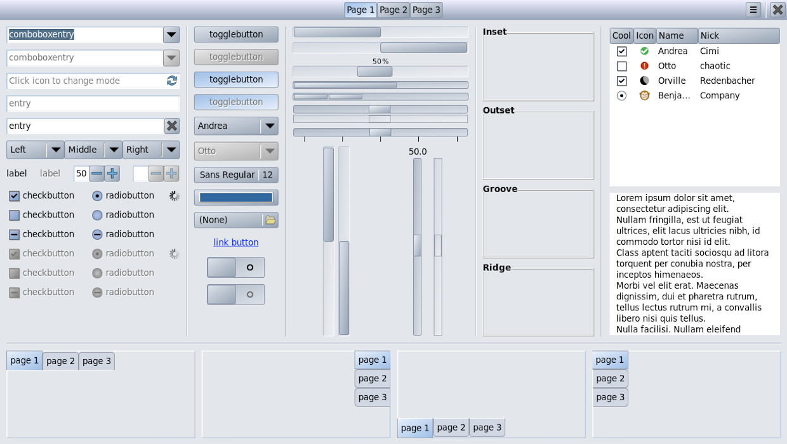

Polished-Blue GTK Theme
===========================

This is the fork of the [Flat-grey-rounded](https://github.com/dimkr/gtk3_flat_grey_rounded) theme, modified to look like the traditional [Polished-Blue Puppy Linux GTK 2 theme](https://distro.ibiblio.org/puppylinux/pet_packages-noarch/gtk_theme_polished_blue-1.2.3.pet).

Preview
-------

Licensing Notice
----------------
This software is released under the terms of the GPL license version 2 as published by the Free Software Foundation. You can freely redistribute and/or modify the software under the terms of the license.

This program is distributed in the hope that it will be useful, but WITHOUT ANY WARRANTY; without even the implied warranty of MERCHANTABILITY or FITNESS FOR A PARTICULAR PURPOSE. See the GNU General Public License for more details.

For more information on details of the license, see the file [LICENSE.md](LICENSE.md).
